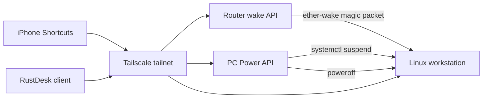

# Router WOL Remote Power

Energy-efficient phone control for a home Linux workstation: wake it, suspend
it, shut it down, and reconnect through RustDesk without exposing ports to the
public internet.

The core idea is simple: use the router you already leave powered on as the
Wake-on-LAN relay. Your phone talks to the router and PC over Tailscale/private
VPN, then iOS Shortcuts call small authenticated HTTP endpoints. The PC can stay
off or suspended when you are not using it, then wake on demand and reconnect
through RustDesk.

## What This Is

- Wake a powered-off PC from an iPhone Shortcut, and wake from suspend when the
  PC firmware/NIC support it.
- Suspend or shut down an awake Linux PC from an iPhone Shortcut.
- Keep the power controls reachable only over a private tailnet/VPN, with no
  WAN port forwards.
- Use the router as the always-on LAN device, avoiding a Raspberry Pi/NAS just
  for WOL relay duty if you do not already run one.
- Preserve Linux/NVIDIA suspend correctness by using `systemctl suspend`, not
  direct `/sys/power/state` or direct `rtcwake`.
- Optional 2-hour idle suspend through GNOME power management after manual
  suspend/wake has been validated locally.

## At A Glance

| Goal | How this repo does it |
| --- | --- |
| Save power | PC can stay suspended or shut down when unused. |
| Avoid another always-on box | The home router, which is already on, sends WOL. |
| Easy phone control | iOS Shortcuts call `/wake`, `/suspend`, `/shutdown`, and `/status`. |
| Avoid public exposure | APIs bind to Tailscale/private IPs; no WAN port forwarding. |
| Keep remote desktop usable | RustDesk reconnects after the PC wakes. |
| Avoid unsafe power cuts | Linux handles suspend/shutdown normally through systemd. |

## Start Here

If you are not already familiar with Wake-on-LAN, router firmware, Linux
services, or Tailscale, start with [docs/start-here.md](docs/start-here.md).

That guide explains:

- what hardware you need
- where to check BIOS/UEFI settings
- how to tell whether your router can work
- what safety settings matter
- what values to collect before editing files
- the order to test wake, suspend, shutdown, and RustDesk

## Why This Is Practical

- **Energy efficient:** the PC can stay suspended or fully off, while the router
  that was already powered on handles wake packets.
- **Easy from the phone:** iOS Shortcuts only need simple `GET` requests with an
  `Authorization` header.
- **No port forwarding:** phone access goes through Tailscale/private VPN
  instead of opening a public WAN port.
- **Normal OS power actions:** suspend and shutdown go through Linux/systemd,
  not a smart plug cutting power.
- A router is already on in most home networks, so the wake relay does not add
  another 24/7 device.
- Raspberry Pi, NAS, mini PC, or Home Assistant relays are fallback options
  only when the router cannot run this kind of private wake service.
- Wake works through Ethernet WOL, which is more reliable than Wi-Fi wake.

It is still hardware-dependent:

- It depends on router firmware, Ethernet WOL, motherboard/UEFI settings, and
  Linux suspend reliability.
- Shutdown-plus-WOL is usually easier to validate than suspend-plus-WOL.
- RustDesk unattended access is convenient but increases the importance of a
  strong password and device/account security.
- A compromised phone, token, or tailnet device could trigger power actions.
- Suspend is not as universal as shutdown; NVIDIA, Wi-Fi, USB, ACPI, and kernel
  versions can all matter.

See [docs/fit-and-tradeoffs.md](docs/fit-and-tradeoffs.md) for the longer
hardware and security discussion.

## Architecture



## Phone Shortcuts

Create three iOS Shortcuts using **Get Contents of URL**.

### PC ON

```text
Method: GET
URL: http://<ROUTER_TAILSCALE_IP>:8080/wake
Header: Authorization: Bearer <TOKEN>
```

This talks to the router because the PC may be asleep or fully off.

### PC SUSPEND

```text
Method: GET
URL: http://<PC_TAILSCALE_IP>:8081/suspend
Header: Authorization: Bearer <TOKEN>
```

This talks to the PC and only works while the PC is awake.

### PC OFF

```text
Method: GET
URL: http://<PC_TAILSCALE_IP>:8081/shutdown
Header: Authorization: Bearer <TOKEN>
```

This talks to the PC and only works while the PC is awake.

Optional status endpoint:

```text
Method: GET
URL: http://<PC_TAILSCALE_IP>:8081/status
Header: Authorization: Bearer <TOKEN>
Expected body: ON
```

Do not put tokens in query strings. Do not commit token files.

## Hardware And Firmware Requirements

Required:

- Ethernet-connected PC.
- Motherboard/UEFI support for Wake-on-LAN from S5/off and/or S3/suspend.
- Router that can send a magic packet on the LAN and run a private wake
  service.
- Private network path such as Tailscale between phone, router, and PC.
- Boot order configured so wake returns to the OS running the PC API.

## Prerequisites, Setup, Safety

| Area | You need | Where to configure/check |
| --- | --- | --- |
| PC hardware | Wired Ethernet and WOL-capable motherboard/NIC | PC BIOS/UEFI and Linux `ethtool` |
| PC firmware | WOL/PCIe wake enabled, ErP/deep sleep disabled if needed | BIOS/UEFI power/APM/PCIe menus |
| Linux | systemd suspend works locally | `systemctl suspend` while physically present |
| Router | Already-on home router that can send WOL and run a private service | Router web UI, SSH shell, package/startup-script support |
| Private network | Phone can reach the router and PC privately | Tailscale or another VPN/private network |
| Phone control | iOS Shortcuts can call private URLs with headers | Shortcuts app |
| Remote desktop | RustDesk unattended access configured privately | RustDesk security settings |
| Safety | No WAN port forwarding, strong tokens, private bind addresses | Router firewall, Tailscale ACLs, token files |

Router fit is capability-based, not brand-based. The intended setup uses the
router as the always-on relay. The router must be able to run a small private
service, persist files, start that service after reboot, and send WOL on the
PC's wired LAN. See [docs/router-support.md](docs/router-support.md).

Router platforms that can work with the right setup:

- ASUSWRT-Merlin with Entware.
- OpenWrt with packages for Python/Tailscale/WOL.
- DD-WRT if persistent scripts and WOL are available.
- pfSense/OPNsense with an equivalent private service.

Fallbacks when the router is locked down:

- NAS, Home Assistant box, Raspberry Pi, mini PC, or any Linux box already on
  the LAN can run the wake API instead. This works, but it is not the main
  energy-efficiency advantage unless that device was already on for other
  reasons.

Common blockers:

- ErP/Deep Sleep firmware settings can disable wake from off.
- Wi-Fi WOL is inconsistent; prefer wired Ethernet.
- USB Ethernet adapters may lose standby power and fail to wake.
- Stock ISP routers often cannot run the private wake service.
- Some Linux systems need NVIDIA/systemd suspend hooks enabled.
- Some USB devices, NVMe drives, Wi-Fi cards, or ACPI firmware break suspend.
- Broadcast WOL behavior depends on the router and LAN bridge.
- The phone can be on Wi-Fi or cellular; it only needs Tailscale reachability to
  the router/PC tailnet IPs.

The included PC service targets Linux with systemd. The architecture can be
adapted to Windows or macOS, but those OSes need their own service and power
helper implementation. See [docs/os-support.md](docs/os-support.md).

## RustDesk Unattended Access

RustDesk is the remote desktop layer; it is separate from WOL. The usual setup
is:

1. Install RustDesk on the PC and phone.
2. Enable/start the RustDesk service on the PC.
3. Set a permanent password for unattended access in RustDesk security settings.
4. Save the PC ID and password in the phone client or shortcut/client workflow.
5. After waking the PC, wait for Tailscale and RustDesk to reconnect, then open
   the saved RustDesk connection.

Do not store the RustDesk password in this repository. Treat it like any other
remote-access credential.

## Suspend Notes

For Linux desktops with NVIDIA and
`NVreg_PreserveVideoMemoryAllocations=1`, direct suspend commands like
`rtcwake -m mem` or writing to `/sys/power/state` can bypass NVIDIA's required
systemd/procfs suspend path. Use `systemctl suspend`.

This repo's PC suspend helper reasserts Ethernet WOL and then calls:

```bash
systemctl suspend
```

## Repository Layout

```text
pc/
  pc_power_api.py                 PC-side shutdown/status/suspend API
  helpers/                        Root-owned helper script templates
  systemd/                        systemd service template
  sudoers.d/                      sudoers allow-list template
router/
  router_wake.py                  Router-side WOL API
  S99wake-api.example             Entware-style init script example
scripts/
  configure_idle_suspend.sh       GNOME 2-hour idle suspend helper
  suspend_via_systemd.sh          Local suspend wrapper
docs/
  start-here.md                   Beginner hardware, settings, and safety guide
  fit-and-tradeoffs.md            When this setup is a good fit
  configuration-values.md         All placeholders and where to find them
  hardware-compatibility.md       Firmware, WOL, and suspend constraints
  linux-suspend-troubleshooting.md
                                   Generic Linux suspend debugging notes
  os-support.md                   Linux, Windows, macOS, and distro notes
  router-support.md               Router-first compatibility and fallbacks
  tailscale.md                    Tailscale/private-network setup
  rustdesk.md                     RustDesk unattended access setup
  setup.md                        End-to-end setup guide
```

## Security Checklist

- Bind APIs to Tailscale/private IPs where supported.
- On ASUSWRT-Merlin/Tailscale userspace setups, `ROUTER_LISTEN_IP=0.0.0.0`
  can be used only with loopback/Tailscale firewall allows, a drop rule for
  other sources, and `ROUTER_ALLOWED_CLIENT_NETS`.
- Use strong random bearer tokens.
- Keep token files outside git and readable only by the service that needs
  them.
- Use Tailscale ACLs if possible so only your phone can reach the power APIs.
- No WAN port forwarding.
- Keep root privileges narrowed to fixed helper paths.
- Test suspend locally before relying on it remotely.
- Treat RustDesk unattended access as a real remote-access credential.

## License

MIT. See [LICENSE](LICENSE).
