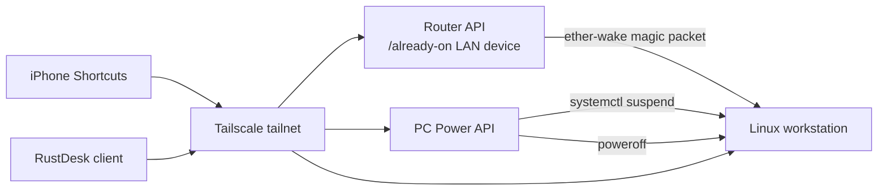

# Router WOL Remote Power

Phone-controlled wake, suspend, shutdown, and remote desktop access for a Linux
workstation without adding another always-on device.

The core idea is simple: use the router you already leave powered on as the
Wake-on-LAN relay, and use Tailscale plus small authenticated HTTP endpoints for
phone shortcuts. The workstation can stay off or suspended when you are not
using it, then wake on demand and reconnect through RustDesk.

## What This Is

- Wake a powered-off or suspended PC from an iPhone Shortcut.
- Suspend or shut down an awake PC from an iPhone Shortcut.
- Keep the PC reachable only over a private tailnet, with no WAN port forwards.
- Use the router as the always-on LAN device, avoiding a Raspberry Pi/NAS just
  for WOL relay duty.
- Preserve Linux/NVIDIA suspend correctness by using `systemctl suspend`, not
  direct `/sys/power/state` or direct `rtcwake`.
- Optional 2-hour idle suspend through GNOME power management.

## Is This The Best Method?

For this hardware class, this is a strong design, but the repo should not claim
it is universally “the best” or “the safest.”

Why it is efficient:

- A router is already on in most home networks.
- No extra always-on relay device is required.
- The high-power machine can spend long periods fully off or in suspend.
- Wake works through Ethernet WOL, which is more reliable than Wi-Fi wake.

Why it is reasonably safe:

- No public WAN port forwarding is needed.
- Tailscale provides the private network path.
- App endpoints require `Authorization: Bearer <TOKEN>`.
- Root actions are limited to narrow helper scripts through sudoers.

Tradeoffs:

- It depends on router firmware, Ethernet WOL, motherboard/UEFI settings, and
  Linux suspend reliability.
- RustDesk unattended access is convenient but increases the importance of a
  strong password and device/account security.
- A compromised phone, token, or tailnet device could trigger power actions.
- Suspend is not as universal as shutdown; NVIDIA, Wi-Fi, USB, ACPI, and kernel
  versions can all matter.

The honest positioning is:

> An energy-efficient phone-controlled WOL/suspend workflow for Linux desktops
> using an already-on router, Tailscale, iOS Shortcuts, and RustDesk.

See [docs/claims.md](docs/claims.md) for the claim matrix and
[docs/evaluation.md](docs/evaluation.md) for tradeoffs.

## Architecture



## Phone Shortcuts

Create three iOS Shortcuts using **Get Contents of URL**.

### PC ON

```text
Method: GET
URL: http://<ROUTER_TAILSCALE_IP>:8080/wake
Header: Authorization: Bearer <TOKEN>
```

This talks to the router because the PC may be asleep or fully off.

### PC SUSPEND

```text
Method: GET
URL: http://<PC_TAILSCALE_IP>:8081/suspend
Header: Authorization: Bearer <TOKEN>
```

This talks to the PC and only works while the PC is awake.

### PC OFF

```text
Method: GET
URL: http://<PC_TAILSCALE_IP>:8081/shutdown
Header: Authorization: Bearer <TOKEN>
```

This talks to the PC and only works while the PC is awake.

Optional status endpoint:

```text
Method: GET
URL: http://<PC_TAILSCALE_IP>:8081/status
Header: Authorization: Bearer <TOKEN>
Expected body: ON
```

Do not put tokens in query strings. Do not commit token files.

## Hardware And Firmware Requirements

Required:

- Ethernet-connected PC.
- Motherboard/UEFI support for Wake-on-LAN from S5/off and/or S3/suspend.
- Router or always-on LAN device that can send a magic packet on the LAN.
- Private network path such as Tailscale between phone, router, and PC.

Likely router fit:

- ASUSWRT-Merlin router with Entware or a similar persistent script mechanism.
- OpenWrt, DD-WRT, pfSense, OPNsense, a NAS, or a small Linux box can also work.

Common blockers:

- ErP/Deep Sleep firmware settings can disable wake from off.
- Wi-Fi WOL is inconsistent; prefer wired Ethernet.
- Some Linux systems need NVIDIA/systemd suspend hooks enabled.
- Some USB devices, NVMe drives, Wi-Fi cards, or ACPI firmware break suspend.
- Broadcast WOL behavior depends on the router and LAN bridge.
- The phone can be on Wi-Fi or cellular; it only needs Tailscale reachability to
  the router/PC tailnet IPs.

The included PC service targets Linux with systemd. The architecture can be
adapted to Windows or macOS, but those OSes need their own service and power
helper implementation. See [docs/os-support.md](docs/os-support.md).

## RustDesk Unattended Access

RustDesk is the remote desktop layer; it is separate from WOL. The usual setup
is:

1. Install RustDesk on the PC and phone.
2. Enable/start the RustDesk service on the PC.
3. Set a permanent password for unattended access in RustDesk security settings.
4. Save the PC ID and password in the phone client or shortcut/client workflow.
5. After waking the PC, wait for Tailscale and RustDesk to reconnect, then open
   the saved RustDesk connection.

Do not store the RustDesk password in this repository. Treat it like any other
remote-access credential.

## Suspend Notes

For Linux desktops with NVIDIA and
`NVreg_PreserveVideoMemoryAllocations=1`, direct suspend commands like
`rtcwake -m mem` or writing to `/sys/power/state` can bypass NVIDIA's required
systemd/procfs suspend path. Use `systemctl suspend`.

This repo's PC suspend helper reasserts Ethernet WOL and then calls:

```bash
systemctl suspend
```

## Repository Layout

```text
pc/
  pc_power_api.py                 PC-side shutdown/status/suspend API
  helpers/                        Root-owned helper script templates
  systemd/                        systemd service template
  sudoers.d/                      sudoers allow-list template
router/
  router_wake.py                  Router-side WOL API
  S99wake-api.example             Entware-style init script example
scripts/
  configure_idle_suspend.sh       GNOME 2-hour idle suspend helper
  suspend_via_systemd.sh          Local suspend wrapper
docs/
  claims.md                       Public claim matrix and evidence links
  hardware-compatibility.md       Firmware, WOL, and suspend constraints
  linux-suspend-troubleshooting.md
                                   Generic Linux suspend debugging notes
  os-support.md                   Linux, Windows, macOS, and distro notes
  setup.md                        End-to-end setup guide
```

## Security Checklist

- Bind APIs to Tailscale IPs, not `0.0.0.0`.
- Use strong random bearer tokens.
- Keep token files outside git and mode `0600`.
- Use Tailscale ACLs if possible so only your phone can reach the power APIs.
- No WAN port forwarding.
- Keep root privileges narrowed to fixed helper paths.
- Test suspend locally before relying on it remotely.
- Treat RustDesk unattended access as a real remote-access credential.

## License

MIT. See [LICENSE](LICENSE).
